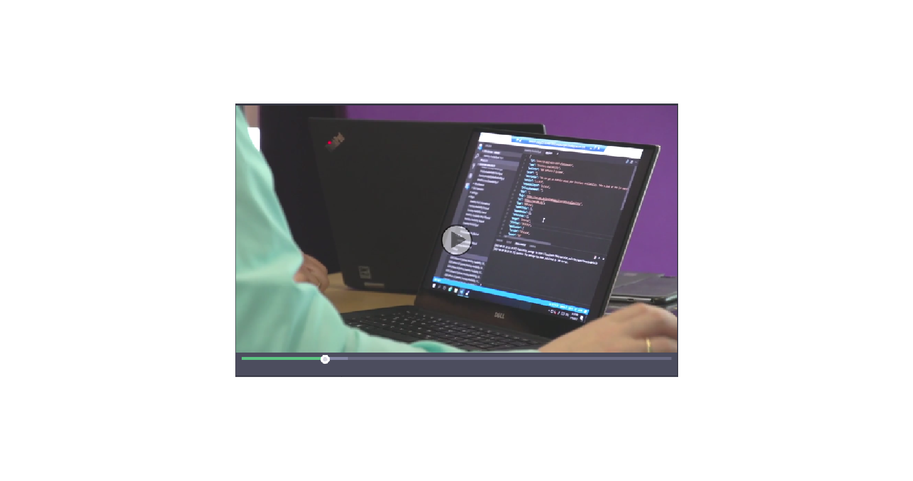

[!INCLUDE[newdev_dev_preview](includes/newdev_dev_preview.md)]

# Developing Apps for Dynamics 365 for Financials
Reach more customers by bringing Apps for Dynamics 365 for Financials into Microsoft Appsource, the marketplace for Microsoft business apps. 
Dynamics 365 gives you rich functionality, a modern always up-to-date platform, and a set of great new development tools.
When your app is done, publish it through Microsoft AppSource – the marketplace for Microsoft’s business apps and start benefiting from a brand that millions of users know and trust.

You decide whether you want to **extend** the Dynamics 365 for financials functionality or **connect** to your existing service.

|<h3>Connect</h3>|<h3>Extend</h3>|
|----------------|---------------|
|A **Connect App** establishes a connection between two independent services using an API to interchange data. A typical example of a Connect App is a Payroll solution. All work related to Payroll is done within your service and only as a last step is the financial data posted into Dynamics 365 for Financials using the API. A Connect App is mainly created using common development tools, REST API’s, and the API’s made available in Dynamics 365 for Financials from Update 7 and onwards. When needed a Connect App in Dynamics 365 for Financials can have a single page or two created as an extension used for setup, configuration or to support for example an import scenario.|Dynamics 365 for Financials supports **Add-On** or **Embed** solutions. An Add-On adds to the existing Dynamics 365 for Financials functionality to integrate a solution such as PayPal, whereas an Embed solution implements an end-to-end experience such as a solution for the dental industry or law firms. An App typically makes use of the variety of development tools for Dynamics 365 for Financials and can also include the APIs available for Dynamics 365 for Financials. An embedded solution can furthermore be rebranded to become an integrated part of the overall end-to-end experience.
|

## Hear what the community tells about Dynamics 365 and the new development tools

## Want to try it out?
It's easy! Just spin up a sandbox environment by going through these steps. 

1) First, you will need an Azure subscription, sign up for a free subscription.  
2) Go to the [Developer Preview](http://aka.ms/navdeveloperpreview).  
3) When you have a virtual machine set up, you will see a welcome text and here you can choose to try out the developer preview following the instructions on the screen.  

> [!NOTE] Build and get inspired by our sample library on [GitHub](https://github.com/Microsoft/al).

<!-- Azure VM, check with Stan

1) Sign up for [Dynamics 365 for Financials]()  
2) Download [Visual Studio Code](https://code.visualstudio.com/Download)  
3) Download the [AL Language extension](vscode:extension/ms-dynamics-smb.al)  
-->

## Ready to build a business App and publish it to Microsoft AppSource?
We are excited to have you in our family of Dynamics 365 for Financials App Providers. Now that you are getting serious about this, here are the steps that you will have to go through: 

#### 1)	Get the prerequisites in place  
To get started with development, you must have a some necessary accounts in place. Next, we ask you to send us your app idea via Microsoft AppSource to get your object range and developer license. Learn more about this step [here](). 

#### 2)	Develop your Dynamics 365 for Financials App   
When developing your App you need to think about some technical aspects of your App.  
If earlier you were building Apps as extensions v1.0 in the classic development tools of Dynamics NAV and you want to publish Apps today we ask you to familiarize yourself with the information on [aka.ms/AppsForFinancials](http://aka.ms/AppsForFinancials).  
In any other case we believe you should familiarize yourself with the development tools for Dynamics 365 for Financials which is in preview. With this toolset you will be able to build extensions v2.0.
Extensions v2.0 have lots of benefits and will be enabled in the Dynamics 365 for Financials service soon. Learn more about extensions 2.0 here and the new development tools [here](https://docs.microsoft.com/en-us/dynamics365/developerbe/devenv-dev-overview?branch=master).  
You also need to spend some time on how to best market your app on Microsoft Appsource. Simply listing your app's features and functionality will not convert prospects to buyers. Learn how to develop the [Marketing aspects](https://go.microsoft.com/fwlink/?linkid=841518) of your App.

#### 3)	Ready for publication?  
If you want to publish an app today we require an extension v1.0 developed in the classic development environment. Please find more information on how to build and publish at [aka.ms/AppsForFinancials](http://aka.ms/AppsForFinancials). 
If you want to publish an extension v2.0, created in the new development tools, we ask you to be a bit more patient. We are currently working hard to create a smooth upload process. We expect to be ready with this publication process early in the fall.

## Things to consider
Are you a business owner, a marketing person, or a developer? You can find specific resources below for you.

### Business owner
[User Registration and Subsequent Billing Procedure](https://mbspartner.microsoft.com/secure/coursematerials/D365B/Standalone/User_Registration_and_Subsequent_Billing_Procedures.pdf)  

[Set Up Your Own Financials Sandbox and Learn How to Self-Monetize](https://mbspartner.microsoft.com/D365B/Videos/101385)  

### Marketing person
[How to Develop a SaaSified User Experience](https://mbspartner.microsoft.com/D365B/Videos/101493)  

[How to Create a Successful App Customer Journey](https://mbspartner.microsoft.com/D365B/Videos/101484)  

[How to Improve Your App Web Presence](https://mbspartner.microsoft.com/D365B/Videos/101491)

### Developer 
[Development Tools and Extensions 2.0](https://mbspartner.microsoft.com/secure/coursematerials/D365B/Standalone/Development_Tools_and_Extensions_2.0.pdf)
 
[How Do I: Design Wizards for HTML Clients in Microsoft Dynamics NAV 2017?](https://mbspartner.microsoft.com/NAV/Videos/101246)  

[Get started with our development tools](https://review.docs.microsoft.com/en-us/dynamics365/developerbe/devenv-dev-overview?branch=master)  

[Read more about integrating with Microsoft Graph](https://developer.microsoft.com/en-us/graph/docs/concepts/overview)  

## Need help?
If you would like some coaching, you can contact an app subject matter expert from the following list:  
•	[Cloud Ready Software](http://cloud-ready-software.com)    
•	[Dynamics App Alliance](http://dynamicsappalliance.com)