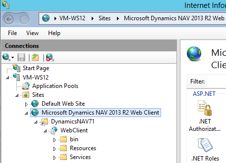

# Deploying the Microsoft Dynamics NAV Web Server Components
Giving users the capability to access to data by using the [!INCLUDE[nav_web](includes/nav_web_md.md)], [!INCLUDE[nav_tablet](includes/nav_tablet_md.md)], [!INCLUDE[nav_phone](includes/nav_phone_md.md)], and Outlook add-in requires a Internet Information Services (IIS) web site as part of your deployment. The website, which we refer to as [!INCLUDE[nav_web_server_instance](includes/nav_web_server_instance md.md) instance, hosts the files that provide content and services to client users over the Internet. This article highlights several factors to consider to help you set up [!INCLUDE[nav_web_server_instance](includes/nav_web_server_instance md.md) instances that suit deployment requirements.

If you want to get started and install the [!INCLUDE[nav_web_server](includes/nav_web_server_md.md)], see [How to: Install the Web Server Components](How-to--Install-the-Web-Server-Components.md).

## ASP .NET Core on IIS 

[!INCLUDE[nav_web_server_instance_md](includes/nav_web_server_instance_md.md)] instances run on ASP.NET Core on IIS, which in part dictates the directory structure of the instances. For more information about ASP .NET Core, see [Introduction to ASP.NET Core](https://docs.microsoft.com/en-us/aspnet/core/). 

## Network Topology 
The following illustration shows the component infrastructure that supports [!INCLUDE[nav_web_server_instance_md](includes/nav_web_server_instance_md.md)] instances on your network.  
  
  
  
Each [nav_web_server_instance_md](includes/nav_web_server_instance_md.md)] instance must connect to a [!INCLUDE[nav_server](includes/nav_server_md.md)], which in turn connects to the database that contains the application and business data. Multiple [nav_web_server_instance_md](includes/nav_web_server_instance_md.md)] instances can connect to the same [!INCLUDE[nav_server](includes/nav_server_md.md)]. You can deploy these components on one computer or on separate computers. For example, you can install the [nav_web_server_instance_md](includes/nav_web_server_instance_md.md)] instance on one computer and the [!INCLUDE[nav_server](includes/nav_server_md.md)] and SQL Server database on another computer. The topology that you choose depends on the network resources and the infrastructure of the [!INCLUDE[navnow](includes/navnow_md.md)] components. The installation and configuration process is different for each scenario.
  
For information about the common deployment scenarios, see [Deployment Scenarios for the Microsoft Dynamics NAV Web Server Components](Deployment-Scenarios-for-the-Microsoft-Dynamics-NAV-Web-Server-Components.md).  
  
##  Creating Dynamics NAV Web Server instances  

There are two ways to create [!INCLUDE[nav_web_server_instance_md](includes/nav_web_server_instance_md.md)] instances. You can use the [!INCLUDE[navnowlong](includes/navnowlong_md.md)] Setup or the [!INCLUDE[nav_shell_md](includes/nav_shell_md.md)].

### [!INCLUDE[navnowlong](includes/navnowlong_md.md)] Setup
[!INCLUDE[navnowlong](includes/navnowlong_md.md)] Setup is the quickest way to get a web server instance for the [!INCLUDE[nav_web](includes/nav_web_md.md)] up and running, and is typically how you install the first [!INCLUDE[nav_web_server_instance_md](includes/nav_web_server_instance_md.md)] instance in your deployment.

-   Setup installs the [!INCLUDE[nav_web_server](includes/nav_web_server_md.md)], which installs a web server instance on IIS but also configures IIS with the required prerequisites, and installs components that enable you to add additional web server instances without having to refer to the [!INCLUDE[navnowlong](includes/navnowlong_md.md)] media (DVD).

-   You can only use Setup to install a single [!INCLUDE[nav_web_server_instance_md](includes/nav_web_server_instance_md.md)] instance. If you want additional instances, you must use the the [!INCLUDE[nav_shell_md](includes/nav_shell_md.md)].

- Setup does not let you choose the site deployment type for the web server instance. By default, it creates a subsite instance.    

### [!INCLUDE[nav_shell_md](includes/nav_shell_md.md)] 
[!INCLUDE[nav_shell_md](includes/nav_shell_md.md)] includes several PowerShell cmdlets that enable you to create, configure, and remove [nav_web_server_instance_md](includes/nav_web_server_instance_md.md)] instances from a command line interface. To create a web server instance, you use the [New-NAVWebServerInstance](Microsoft.Dynamics.Nav.Management/new-navwebserverinstance.md) cmldet, which has the following advantages over Setup:
   
-   You can create multiple web server intances.
-   You have more flexibility regarding the deployment structure of the [nav_web_server_instance_md](includes/nav_web_server_instance_md.md)] instances on IIS. For example, you can create a parent instance (rootsite) that can have one or more child instances (subsites).

You should be aware that the New-NAVWebServerInstance cmdlet does not install or configure the required IIS prequisites. So unless you have previously installed the [!INCLUDE[nav_web_server](includes/nav_web_server_md.md)] by using Setup, you will have to configure the prerequisites manually. For more information about the prerequistes, see 
[How to: Install and Configure Internet Information Services for Microsoft Dynamics NAV Web Client](How-to--Install-and-Configure-Internet-Information-Services-for-Microsoft-Dynamics-NAV-Web-Client.md).    

## Site Deployment Types
There are two types of [!INCLUDE[nav_web_server_instance_md](includes/nav_web_server_instance_md.md)] instances that you can create: RootSite or SubSite. The instance types have a different hierarchical structure in IIS, which influences the configuration and the URLs for the accessing the [!INCLUDE[nav_web](includes/nav_web_md.md)
 
-   A *RootSite* instance is a root-level web site that is complete with content files, and it configured with its own set of bindings for accessing the site, such as protocol (http or https) and communication port. The URL for the web server instance has the format `http://[WebserverComputerName]:[port]`, for example *http://localhost:8080* or *https://localhost:8080/*. 

-   A *SubSite* instance is an web application that is under a container web site. The container web site is configured with a set of bindings, but the site itself has no content files. The content files are contained in the application (subsite). The application inherits the bindings and other configuration settings from the container web site. The URL of a subsite instance is generally longer than a rootsite because it also contains the application's alias (or virtual path), which you define. The URL for a subsite instance has the format `http://[WebserverComputerName]:[port]/[WebServerInstance]`, for example *http://localhost:8080/dynamicsnav* or *https://localhost:8080/dynamicsnav*.

## Dynamics NAV Web Server Components Installation on IIS          
When you install [!INCLUDE[nav_web_server](includes/nav_web_server_md.md)], a web server instance is added on IIS for the [!INCLUDE[nav_web](includes/nav_web_md.md)]. The web server instance consists of a virtual directory and application. The following illustration shows the structure in Internet Information Services Manager. For more information about these elements in IIS, see [IIS Manager UI](http://go.microsoft.com/fwlink/?LinkID=614897).  
  
   
  
 The following table includes the default settings for each element of the website structure.  
  
 **Website**  
  
|Setting|Value|  
|-------------|-----------|  
|Name|[!INCLUDE[navnowlong](includes/navnowlong_md.md)] Web Client|  
|Binding|Type: http or https \(if you configure SSL on the [!INCLUDE[nav_web_server](includes/nav_web_server_md.md)]\)   Port: Port number you assigned the [!INCLUDE[nav_web](includes/nav_web_md.md)] \(default 8080\)|  
|Application pool|DefaultAppPool|  
|Application pool identity|ApplicationPoolIdentity|  
|Physical path|%systemroot%\\inetpub\\wwwroot\\NavWebApplicationContainer|  
|Authentication|Windows Authentication|  
  
<!--> **Virtual directory**  
  
|Setting|Value|  
|-------------|-----------|  
|Physical path|%systemroot%\\inetpub\\wwwroot\\[!INCLUDE[nav_server_instance](includes/nav_server_instance_md.md)]|  
|Virtual path/Alias|/[!INCLUDE[nav_server_instance](includes/nav_server_instance_md.md)]   By default, this name matches the name of the [!INCLUDE[nav_server](includes/nav_server_md.md)] instance that the [!INCLUDE[nav_web_server](includes/nav_web_server_md.md)] connects to.|  -->

  
 **Web application**  
  
|Setting|Value|  
|-------------|-----------|  
|Application pool|[!INCLUDE[nav_server_instance](includes/nav_server_instance_md.md)]|  
|Application pool identity|ApplicationPoolIdentity|  
|Physical path|%systemroot%\\inetpub\\wwwroot\\[!INCLUDE[nav_server_instance](includes/nav_server_instance_md.md)]|  
|Virtual path/Alias|/[!INCLUDE[nav_server_instance](includes/nav_server_instance_md.md)]|  
|Protocol|http|  
|Authentication|Windows Authentication, Forms authentication, Anonymous Authentication, and ASP.NET Impersonation.|  
  
## Deployment Phases  
 Typically, you will deploy the [!INCLUDE[nav_web](includes/nav_web_md.md)] in phases, which can influence the network topology and security settings that you deploy. For example, in the development phase, you develop, test, and fine-tune the application. In this phase, you might consider deploying the [!INCLUDE[nav_web](includes/nav_web_md.md)] in a single-computer scenario. When you move to the production phase, you deploy the [!INCLUDE[nav_web](includes/nav_web_md.md)] in the full network infrastructure.  
  
## Security  
  
### User Authentication  
 [!INCLUDE[navnow](includes/navnow_md.md)] supports four methods for authenticating users who try to access the [!INCLUDE[nav_web](includes/nav_web_md.md)]: Windows, UserName, NavUserPassword, and AccessControlService. Windows authentication is configured by default. For more information, see [Users and Credential Types](Users-and-Credential-Types.md) and [How to: Configure Authentication of Microsoft Dynamics NAV Web Client Users](How-to--Configure-Authentication-of-Microsoft-Dynamics-NAV-Web-Client-Users.md).  
  
### Service Account for [!INCLUDE[nav_server](includes/nav_server_md.md)] and [!INCLUDE[navnow](includes/navnow_md.md)] Database Access  
 When you install [!INCLUDE[nav_server](includes/nav_server_md.md)] and [!INCLUDE[navnow](includes/navnow_md.md)] database components, you must identify an Active Directory account to provide credentials for the servers. By default, [!INCLUDE[navnowlong](includes/navnowlong_md.md)] Setup runs [!INCLUDE[nav_server](includes/nav_server_md.md)] and the [!INCLUDE[navnow](includes/navnow_md.md)] database under the Network Service account, a predefined local account that is used by the service control manager.  
  
> [!TIP]  
>  We recommend that you create and use a domain user account for running [!INCLUDE[nav_server](includes/nav_server_md.md)] and accessing the [!INCLUDE[navnow](includes/navnow_md.md)] database. The Network Service account is considered less secure because it is a shared account that can be used by other unrelated network services.  
  
 For more information, see [Provisioning the Microsoft Dynamics NAV Server Account](Provisioning-the-Microsoft-Dynamics-NAV-Server-Account.md).  
  
### Securing the Connection to Microsoft Dynamics NAV Web Client With SSL  
 You can help secure [!INCLUDE[navnow](includes/navnow_md.md)] data that is transmitted over the Internet by enabling Secure Sockets Layer \(SSL\) on the connection to the [!INCLUDE[nav_web](includes/nav_web_md.md)]. You can configure SSL when you install the [!INCLUDE[nav_web_server](includes/nav_web_server_md.md)] or after the installation.  
  
 For more information, see [How to: Install the Web Server Components](How-to--Install-the-Web-Server-Components.md) and [How to: Configure SSL to Secure the Connection to Microsoft Dynamics NAV Web Client](How-to--Configure-SSL-to-Secure-the-Connection-to-Microsoft-Dynamics-NAV-Web-Client.md).  
  
## See Also  
 [Dynamics NAV Web Client](Microsoft-Dynamics-NAV-Web-Client.md)   
 [How to: Install the Web Server Components](How-to--Install-the-Web-Server-Components.md)  
 [How to: Install and Configure Internet Information Services for Microsoft Dynamics NAV Web Client](How-to--Install-and-Configure-Internet-Information-Services-for-Microsoft-Dynamics-NAV-Web-Client.md)  
 [Configuring-the-Dynamics-NAV-Web-Server-and-Client.md](Configuring-the-Microsoft-Dynamics-NAV-Web-Server-and-Client.md)  