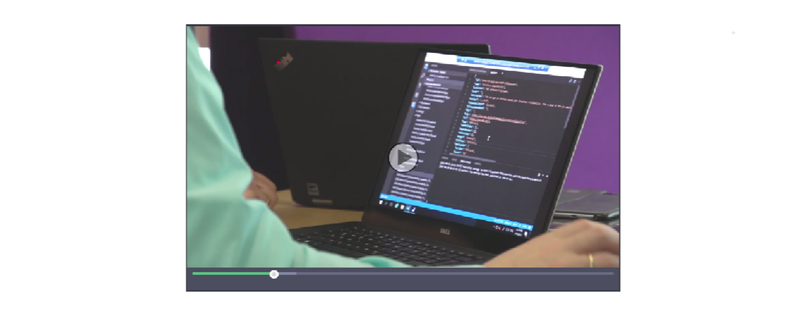

[!INCLUDE[newdev_dev_preview](includes/newdev_dev_preview.md)]

# Developing Connect Apps for Dynamics 365 for Financials
Reach more customers by bringing apps for Dynamics 365 for Financials into Microsoft Appsource, the marketplace for Microsoft business apps. 
Dynamics 365 gives you rich functionality, a modern always up-to-date platform, and a set of great new development tools.
When your app is done, publish it through Microsoft AppSource – the marketplace for Microsoft’s business apps and start benefiting from a brand that millions of users know and trust.

A **Connect app** establishes a connection between two independent services using an API to interchange data. A typical example of a Connect app is a Payroll solution. All work related to Payroll is done within your service and only as a last step is the financial data posted into Dynamics 365 for Financials using the API. A Connect app is mainly created using common development tools, REST API’s, and the API’s made available in Dynamics 365 for Financials from Update 7 and onwards. When needed a Connect app in Dynamics 365 for Financials can have a single page or two created as an extension used for setup, configuration or to support for example an import scenario.

<!--
## Hear what the community tells about Dynamics 365 and the new development tools

-->

## Want to try it out?
It's easy to get started! Just spin up a sandbox environment by going through these steps.

1) Sign up for a [Dynamics 365 for Financials sandbox](https://aka.ms/GetSandboxForFinancials).    
2) Download [Postman](https://www.getpostman.com/)
3) 

For documentation on the APIs, you can get our published preview [here](https://msdn.microsoft.com/en-us/dynamics-nav/fin-graph/index).

<!-- 
Interested in an on-premise version? It's just as easy. Just sign up by following these steps.

1) First, you will need an Azure subscription, sign up for a free subscription.  
2) Go to the [Developer Preview](http://aka.ms/navdeveloperpreview).  
3) When you have a virtual machine set up, you will see a welcome text and here you can choose to try out the developer preview following the instructions on the screen.  

--> 
## Ready to build a business app and publish it to Microsoft AppSource?
We are excited to have you in our family of Dynamics 365 for Financials App Providers. Now that you are getting serious about this, here are the steps that you will have to go through: 

#### 1)	Get the prerequisites in place  
To get started with development, you must have some necessary accounts in place. Next, we ask you to send us your app idea via Microsoft AppSource to get your object range and developer license. Learn more about how to get your prerequisites in place [here](https://go.microsoft.com/fwlink/?linkid=857095). 

#### 2)	Develop your Dynamics 365 for Financials App   
For more information about everything you need to know about how to develop the technical aspects of your Financials Connect app, get the [Develop the technical aspects of your app](https://go.microsoft.com/fwlink/?linkid=841516) document.
You also need to spend some time on how to best market your app on Microsoft AppSource. Simply listing your app's features and functionality will not convert prospects to buyers. Learn how to develop the [Marketing aspects of your app](https://go.microsoft.com/fwlink/?linkid=841518).

#### 3)	Ready for publication?  
Before we publish, we will collaborate with you to ensure that your app stands out on Microsoft AppSource and on your own landing page! We need to validate your app to ensure it is marketed well, trustworthy, and is up-to-date. For more information about the validation process and how to publish your app, get the [Publish your app](https://go.microsoft.com/fwlink/?linkid=841517) document.

## Questions?
This [FAQ](https://go.microsoft.com/fwlink/?linkid=841520) responds to the most common questions you might have about apps for Dynamics 365 for Financials. If you have further questions, don't hesitate to [email us](mailto:d365val@microsoft.com).

## Things to consider
Are you a business owner, a marketing person, or a developer? You can find specific resources below for you.

### Business owner
[User Registration and Subsequent Billing Procedure](https://mbspartner.microsoft.com/secure/coursematerials/D365B/Standalone/User_Registration_and_Subsequent_Billing_Procedures.pdf)  
[Set Up Your Own Financials Sandbox and Learn How to Self-Monetize](https://mbspartner.microsoft.com/D365B/Videos/101385)  

### Marketing person
[How to Develop a SaaSified User Experience](https://mbspartner.microsoft.com/D365B/Videos/101493)  

[How to Create a Successful App Customer Journey](https://mbspartner.microsoft.com/D365B/Videos/101484)  

[How to Improve Your App Web Presence](https://mbspartner.microsoft.com/D365B/Videos/101491)

### Developer 
[Development Tools and Extensions 2.0](https://mbspartner.microsoft.com/secure/coursematerials/D365B/Standalone/Development_Tools_and_Extensions_2.0.pdf)
 
[How Do I: Design Wizards for HTML Clients in Microsoft Dynamics NAV 2017?](https://mbspartner.microsoft.com/NAV/Videos/101246)  

[Get started with our development tools](devenv-get-started.md)  

[Read more about integrating with Microsoft Graph](https://developer.microsoft.com/en-us/graph/docs/concepts/overview)  

## Need help?
If you would like some coaching, you can contact an app subject matter expert from the following list:  
•	[Cloud Ready Software](http://cloud-ready-software.com)    
•	[Dynamics App Alliance](http://dynamicsappalliance.com)

Partners in this list:

•	Are listed alphabetically  
•	Are assisting or have assisted a minimum of three partners with bringing apps into Microsoft AppSource  
•	Have a packaged service available (and listed on their website) about the app guidance that they provide  

If you believe you should be listed as an app service partner, don't hesitate to [reach out to us](mailto:d365val@microsoft.com).