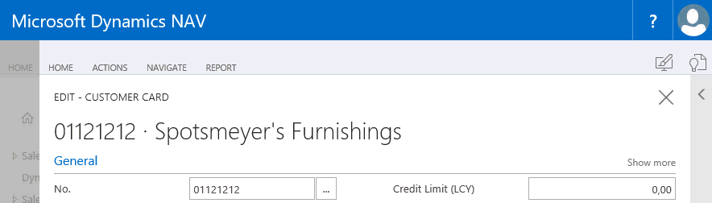

[!INCLUDE[newdev_dev_preview](includes/newdev_dev_preview.md)]

# Using the In-Client Designer

With the [!INCLUDE[d365fin_long_md](includes/d365fin_long_md.md)] in-client designer, you can create extensions using drag-and-drop functionality inside the client. With this preview of the in-client designer, you can:  

- Enter and exit design mode  
- Perform admin modifications
- Add, move, and remove fields
- Add, move, and remove columns in a list
- Set or change freeze pane to columns in a list view
- Add, move, and remove cues (tiles)
- Move and remove entire parts
- Preview your design (desktop, tablet, and phone preview)
- Save the extension for the tenant

## Enter and exit design mode  

The in-client designer is switched on by choosing the design icon in the ribbon top right corner from any page that you want to make modifications to, and then choosing **More**.  

> [!NOTE]  
> With this preview you can only add existing table fields. Adding pages, groups, parts, and actions is not yet supported.

  
  
In design mode, you modify the current page; you can add existing table fields, move fields around, or remove fields from the page. Finish up design by choosing **Stop Designing**, which allows you to name the extension with an option to download code, and save the extension for the tenant. 

## Perform admin modifications  

You can use the in-client designer to make changes what everybody in a specific role sees, by customizing the workspace to suit your global business standards by changing pages to display the information it needs, and where it needs.  

## Add, move, and remove fields

|Action|Applies to   | Description    |
|------|-----------------|--------------|
|Add|Field, column, tile |**Add field**: Use the add field functionality to add a field to the page. You will get a pane to the right where you can see all of the table fields that are available for the specific page. The table fields displayed are based on the underlying table or tables. The field can have a status of **Placed**, which means that the field already exists on the page. A status of **Ready** means that the field doesn't already exist on the page, and that you can place it.|
|Move|Field, column, tile, or a part |**Move field**: Point anywhere on a field, and drag it to its new location. The location is indicated by either a thick horizontal or vertical line.|
Remove|Field, column, tile or a part |**Remove field**: To remove a field, select the arrowhead indicator, and choose **Remove**.|

## Other things to be aware of
When you modify subpages on a given page, a square is displayed to mark the area that you can move a field within. This is also true for FactBoxes.

Change a FastTab caption by clicking the caption and start writing.

The display type icons let you preview the changes you made on desktop, tablet, and phone clients. This way you can make sure that your design will work on the intended display target(s). You can flip to display tablet and phone designs in landscape as well.

## See Also
[Developing Extensions](devenv-dev-overview.md)  
[Getting Started](devenv-get-started.md)  
[Developer Reference](devenv-reference-overview.md)
