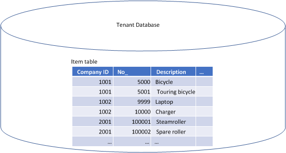

# Converting to Shared Schema
Shared schema is a data model that shares database resources among tenants and companies. Shared schema optimizes the reuse of resources, such as execution plans, memory, and database connections. 

Shared schema can be used in single tenant or multitenant deployment, although it is especially designed for a multitenant deployment. It enables you to have multiple tenants in the same database, where you have access to the states of both the tenants and the database. You can upgrade tenants individually to different application versions, which means that in a database, tenants can support different application versions.

## Overview
To help explain shared schema, let's first look at the conventional [!INCLUDE[navnow_md](includes/navnow_md.md)] data model, which is referred to as *separate schema*.

> [!TIP]
> A tenant is one or more companies, typically part of a business or legal entity, with common access to the application but with dedicated storage of business data in the database. In a single tenant deployment, the application and tenant business data are stored in the same database. In a multitenant deployment, the application is stored in one database, and the tenant business data in another database.

### Separate schema 
By default, [!INCLUDE[navnow_md](includes/navnow_md.md)] uses a *separate schema* data model. A database that uses separate schema has the following characteristics: 

-  It contains business data for one tenant only.

    In practical terms, a tenant is the database. This means that in a multitenant deployment, you have a separate database for each tenant. 
-  Each company has a separate set of tables for storing business entity data, such as the Item, Customer, and Invoice tables (see figure 1). 


**Figure 1: Company business data with the separate schema**

### Shared schema

A database that uses the shared schema data model has the following characteristics: 

-  It can be shared by more than one tenant. Information about the tenants and their companies is stored in shared tables in the database (see figure 2).

   This is a change to the concept of a tenant/tenant database as compared with the separate schema model, which has one tenant per database (the tenant database). With shared schema, the tenant database is a container for one or more tenants, and each tenant is a unit of data in the tenant database (see figure 2).
   
   You can have multiple tenant databases among which you can mount, delete, and move tenants.  
-  Companies share tables for storing business data.

    There is one set of business entity data tables for all companies and tenants in the database. For example, instead  of an Item table for each company, there is a single table that contains the data for all companies (see figure 3).


**Figure 2: Tenant and company information with shared schema**

 

**Figure 3: Company business data with shared schema**

## Convert to shared schema
To convert to shared schema, you use the [Sync-NAVTenant cmdlet](https://go.microsoft.com/fwlink/?linkid=401399) that is included in the [nav_shell_md](includes/nav_shell_md.md). 


1. Open the [nav_shell_md](includes/nav_shell_md.md) as an administrator.

2. If not already mounted, mount the tenant that you want to convert to the [!INCLUDE[nav_server_md](includes/nav_server_md.md)] instance.

    ```
    Mount-NAVTenant –ServerInstance "[server_instance_name]" -Tenant "[tenant_ID]" –DatabaseServer "[server]\[database_instance]" -DatabaseName "[database_name]’
    ```

3. Run the Sync-NAVTenant cmdlet with the `-Mode` parameter set to `ConvertToSharedSchema`.

    ```
    Sync-NAVTenant -ServerInstance  "[server_instance_name]" -Tenant "[tenant_ID]" -Mode ConvertToSharedSchema
    ```


## See Also  
[Microsoft Dynamics NAV Windows PowerShell Cmdlets](Microsoft-Dynamics-NAV-Windows-PowerShell-Cmdlets.md)   
[Configuring Microsoft SQL Server](Configuring-Microsoft-SQL-Server.md)   
[Configuring Microsoft Dynamics NAV](Configuring-Microsoft-Dynamics-NAV.md)  
